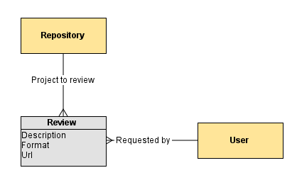

# opencodereview

A platform for finding code reviewers for your GitHub project.

Developers often work on their Open Source project and want
input or a code review for their project.
However finding a reviewer becomes tricky if you don't know
the right people personally.

A platform where GitHub projects can be submitted for reviews
and voluntary reviewers can find interesting projects
would help improving the quality and visibility
of many projects and boost social collaboration on GitHub.


## Community

> People who submit a project
  for a review should be willing
  to review projects themselves.

The platform only works if there are enough reviewers.
The principle of "Give and Take" is similar to
[Couchsurfing](https://www.couchsurfing.com/) or
[Warm Showers](https://www.warmshowers.org/) where the
community organizes itself.

### Benefits

Developer:
- Feedback for project
- Increased quality
- Valuable learnings
- More visibility of project

Reviewer:
- Dive into the source code of interesting projects
- Chance for getting projects reviewed themselves
- Valuable contribution to Open Source community

Shared benefits:
- More social collaboration on interesting projects
- One place to ask and look for reviews

**Distinctions:**

- The platform is not meant for finding reviewers for a pull request.
- The platform only works as a mediator between projects and reviewers,
  reviews themselves happen elsewhere.

## Use Cases

- Joe is a Pythonista but is creating a cool new project in
  [Go](https://golang.org/)
  with which he is unfamiliar with.
  He would like someone with more expertise to take a look at his
  project and tell him where he could write more idiomatic code
  or whether he writes readable Go code.
- Joe on his part reviews a [Django](https://www.djangoproject.com/)
  project (with which he is very familar)
  and gives feedback about best practices.

## Open Reviews today

Open Source reviews already happen today in various forms:

- GitHub pull requests
- GitHub issues
- Security audits (like https://www.eff.org/deeplinks/2011/09/open-source-security-auditing)
- Blog posts (like http://ayende.com/blog/2976/code-review-petshop-3-0)
- Mailing lists (https://groups.google.com/forum/#!forum/golang-codereviews)
- Direct mail (if someone is explicitely asked for their opinion)

## Onboarding

In order to review projects or get your project reviewed
you simply sign up with your GitHub account.

From the GitHub account we can pull all the projects
the user worked on and create a profile
(similar to the [Github resume](https://resume.github.io/)):

- Languages used
- Technologies used
- Location
- Contact possibilities

## Submit project

The user chooses a repository from his GitHub account and
describes what he expects from a review and in which form
he would like the review.
After that the platform takes over and constantly looks for
reviewers that match the project profile.

## Mediating reviewers and projects

The web application is only the mediator between
the reviewer and the project. The review itself can happen
anywhere (via GitHub issue, email or blog post).
Reviewers can use any form they like.

The only data about the review itself is provided via an optional URL
to the completed review.

The platform tracks who reviewed what and provided which projects.

The platform helps matching appropriate projects to
appropriate viewers by looking at the qualifiers collected
from the GitHub account:

- Similarity in projects (many Django projects)
- Expertise in Language (via published repositories)
- Developers with more stars are usually more popular
- Location / Language (preferably from same country or region)

## Project search

Users can search for a project by providing
- technology (e.g. "Django", "Rails", "Meteor", "Node")
- programming language (e.g. "python", "Ruby", "JavaScript")
- project name (e.g. "chromium")
- project owner (e.g. "lukasmartinelli")
- project description (e.g. "ast parser")

## Project

Most data for a project is already provided by GitHub:

- Project name
- Repository link
- Description
- Languages / Technologies used
- Code statistics (SLOC, language percentage)

Additional data:

- What is expected from the review
- Desired form of review

## Reviewer

- Projects reviewed by reviewer
- Qualifiers extracted from GitHub Profile
- Projects submitted for review

> Idea: Show interactions (reviews and requests) between
  developers and projects in a graph like view

## Data Model

The goal is to have the simplest possible data model that allows
a lot of freedom for the reviewers and developers.
User and repository are both resources of the GitHub API where
we do not need any additional information as it can be requested
from the API.

There can only be one **open** review for project at a time.
Once a review is completed it is possible to request a new review.
For simplicity's sake any user can request a review for any repository.

A review is assigned to only one reviewer. However if multiple
reviewers are interested it is still possible.



## Time estimation

- Project setup **2h**
- HTML Design **8h**
- GitHub OAuth **2h**
- Request review **4h**
- Review project **2h**
- User detail **2h**
- Review detail **2h**

## Setup Project

Create the database.

```sql
create user opencodereview with password 'opencodereview';
create database opencodereview with owner opencodereview;
```
